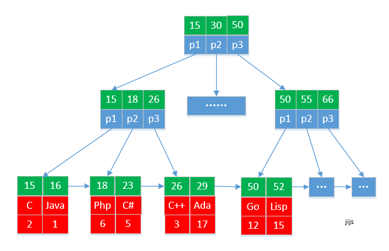
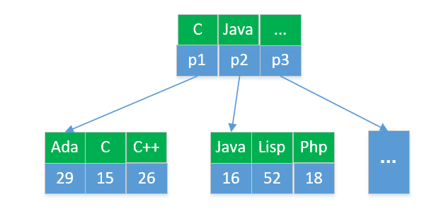

#### 数据结构与算法

首先介绍在 MapReduce - Map 阶段采用快速排序和归并排序算法。

Map 阶段的输出会先写入缓冲带，缓冲带利用率达到 80% 会 Split 成小文件，这个阶段用的快速排序；Reduce 阶段之前每个 Map 端会把 Split 的多个文件合并为一个文件，这个阶段为归并排序。

#### 快速排序
快速排序的思想：以数组中最小/最大位置为基准，小于基数的元素交换到基数的左边，大于基数的元素交换到基数的右边，这个过程时间为 n；

递归快排左分区，结束条件为分区只有一个元素，递归的深度为 log(n/2)；

递归快排右分区，结束条件为分区只有一个元素，递归的深度为 log(n/2)；

快速排序在最快的情况下是冒泡排序，时间复杂度为 O(n2)；最好的情况是 O(nlogn)；平均时间复杂度为 O(nlogn)，快速排序的时间复杂度与数组初始顺序有关，是一种不稳定的排序方法。

思考：基准必须为 low 或 high 么？能否随机选择一个中间点为基准？以及为何要从距离 p 大的一边开始移动？

答： i. 必须为 low 或 high，如果以中间为基准，左右相等的时候无解.
    ii. 从那边开始移动决定了相遇位置的值是大于 p 还是小于 p; 假如 p 是 low, 从 low 开始移动, 相遇位置的值应该比 p 大, 那么相遇的位置就不是基准位置了。

#### 归并排序

编程之前：先找出「递推式」和 「终止条件」。

归并排序的思想: 分治，先分后合；1) 递推式: 数组分为左右两个数组，然后左右两个已排好序的数组 merge；2) 终止条件：left==right。

归并排序是稳定的排序算法，时间复杂度为 O(nlogn)。

#### 跳表
Redis 的有序集合(sorted set) 就是用跳表实现的。

跳表的思想是基于链表的二分查找，数据结构为多级索引链表。

如果每两个节点抽出一个节点作为索引节点，那么 K 级索引的节点个数为 n/(2^K)。

假设索引有 h 级，最高级索引有2个节点，那么 n/(2^h)=2，从而求的 h=log2n-1。包含原始链表这一层，整个跳表的高度为 log2n。

而每一层要遍历 m 个节点，m 最多为 3，因此跳表的时间复杂度为 O(logn) ，与二分查找时间复杂度一样.

索引动态更新：当我们不停的往跳表中插入数据时，为了保持索引与原始链表的平衡，我们需要一个随机函数，决定将这个节点插入到哪几级索引。

跳表是利用空间换时间的思想，空间复杂度为 O(n)，即原始链表有 n 个节点，需要额外的 n 个节点的存储空间。

但在实际开发中，原始链表存储的可能是很大的对象，索引节点只存储关键值和几个指针，并不需要存储对象，

因此当对象比索引节点大很多时，索引占用的额外空间可以忽略。 

#### 二叉查找数
二叉查找树的定义：左子树都小于根结点，右子树都大于根结点。

完全二叉查找树的高度: 高度=层+1，第 K 层元素个数 = 2^(K-1)，最后一层元素个数在 1～2^(h-1) 之间。

等比数列求和: n>=1+2+4+...+2^(h-2)+1; n<=1+2+4+...+2^(h-1) => h 在 [log2(n+1), log2n+1]，即完全二叉树的层数小于 log2n+1，也小于 log2n。因此完全二叉树的查找、插入、删除操作的时间复杂度稳定在 O(logn)。

#### 红黑树
平衡二叉查找树的严格定义：任何一个节点的左右子树的高度相差不超过 1，而 AVL 树是一种高度平衡的二叉查找树。

平衡二叉查找树发明的初衷是解决普通二叉查找树在频繁的插入、删除等动态更新的情况下，出现时间复杂度退化的情况。（最坏的情况会退化为单链表，时间复杂度为 O(n)。）

红黑树的定义：

1. 节点只有红色和黑色两种颜色。
2. 根结点是黑色。
3. 叶子结点都是黑色的空节点。
4. 相邻节点不能都是红色。
5. 每个节点到叶节点的所有路径上黑色节点个数相同。

红黑树是近似平衡的，根节点到各个叶子结点的最长路径可能比最短路径大 1 倍，插入、删除、查找操作的时间复杂度稳定在 O(logn)。

#### B+ 树
数据库 MySQL 需求：根据某个值查找数据；根据区间值查找数据。

散列表和平衡二叉查找树：不支持按区间快速查找，不满足需求。

跳表可以支持需求，但 MySQL 索引所用到的数据结构是 B+ 树，通过二叉查找树演化而来。

B+ 树：叶子结点串联在一个双向链表上，其他节点均为索引，很像跳表。拿到区间的起始值，在二叉查找树中找到某个叶子结点之后，顺着链表往后遍历即可。

考虑给 1 亿个数据构建索引，大约需要额外的 1 亿个节点，每个节点假设 16 字节，需大约 160*10^6~ 1GB 空间。如果要给 10 张表建立内存，那内存无法满足需求。

为了满足存储需求，B+ 树的索引存储在硬盘中，这样树的高度直接导致磁盘 IO 的次数，因此 B+ 树优化的核心是降低树的高度，减少磁盘 IO。

B+ 树在数据结构上是平衡 m 叉查找树，树的高度是 logmn，一亿个数据，m=100，最多需要 log100(100^3)=3次 磁盘 IO 即可获取到数据。

m 的大小：无论内存还是磁盘，数据都是按页存储(4KB)，节点大小超出一页，会触发多次 IO，选择的 m 尽量让每个节点小于等于 一页。

#### MySQL中InnoDB引擎的索引划分
聚簇索引：索引和数据存储在一块，以主键为索引的 B+树，比如 3 叉树：每页存储 3 个节点，叶节点的 data 域存储完整的数据记录。

二级索引：二级索引和数据是分离的，存储索引数据和id的映射。叶节点的data域存储主键。

索引注意事项：
1. 尽量选择区分度高的列作为索引；
2. 避免在 where 中对字段进行 null 值判断导致引擎放弃使用索引而进行全表扫描。
3. 避免 !=、<>、or 等符号，会导致引擎放弃使用索引而进行全表扫描。

#### 堆排序